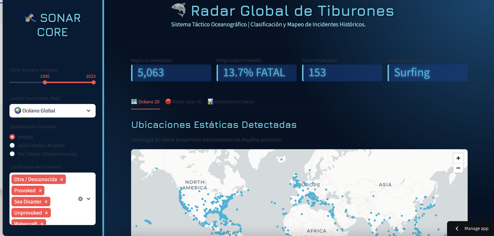
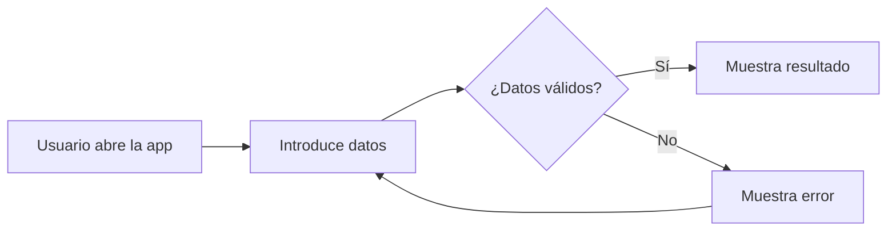

# 🌍 GeoDash Explorer

## 📸 Demo



🔗 **Demo en vivo:** https://geodashtiburones.streamlit.app


## 📋 Tabla de contenidos

- [Descripción](#-descripción): Breve introducción sobre los proyectos y su propósito.
- [Características](#-características): Lista de funcionalidades clave de cada proyecto.
- [Tecnologías](#-tecnologías): Herramientas y lenguajes utilizados en el desarrollo.
- [Instalación](#-instalación): Pasos para configurar y ejecutar los proyectos en tu entorno.
- [Uso](#-uso): Instrucciones para interactuar con las aplicaciones.
- [Estructura](#-estructura-del-proyecto): Organización de archivos y carpetas en el repositorio.
- [Lo que aprendí](#-lo-que-aprendí): Reflexiones y aprendizajes obtenidos durante el desarrollo.
- [Mejoras futuras](#-mejoras-futuras): Ideas para expandir y optimizar los proyectos.
- [Autor](#-autor): Información de contacto y enlaces del creador.

---

## 📖 Descripción

### Dashboard Pokémon
Este proyecto es un dashboard interactivo que utiliza datos de Pokémon GO para visualizar la aparición de Pokémon en un mapa. Está diseñado para fanáticos del juego y analistas de datos que deseen explorar patrones de aparición basados en ubicación, clima y otros factores.

### Radar de Tiburones
El Radar Global de Tiburones es una herramienta interactiva para analizar y mapear incidentes históricos relacionados con tiburones. Ideal para investigadores marinos y entusiastas del océano.

Ambos proyectos destacan por su capacidad de visualización geoespacial y su diseño interactivo.

---

## ✨ Características

### Dashboard Pokémon
- ✅ Visualización de mapas 3D con PyDeck.
- ✅ Gráficos interactivos con Plotly.
- ✅ Personalización estética con CSS para una experiencia inmersiva estilo retro.
- ✅ Filtros avanzados por clima, hora y ubicación.

### Radar de Tiburones
- ✅ Visualización de datos geoespaciales en mapas interactivos.
- ✅ Diseño temático inspirado en el océano.
- ✅ Métricas clave resaltadas con un diseño visual atractivo.
- ✅ Clasificación y análisis de incidentes históricos.

---

## 🛠️ Tecnologías

### Dashboard Pokémon
| Tecnología | Para qué |
|------------|----------|
| Streamlit  | Crear la interfaz web interactiva |
| Pandas     | Análisis y manipulación de datos |
| PyDeck     | Visualización de mapas 3D |
| Plotly     | Gráficos interactivos |
| CSS        | Personalización del diseño |

### Radar de Tiburones
| Tecnología | Para qué |
|------------|----------|
| Streamlit  | Crear la interfaz web interactiva |
| Pandas     | Análisis y manipulación de datos |
| PyDeck     | Visualización de datos geoespaciales |
| Plotly     | Gráficos interactivos |
| CSS        | Diseño temático inspirado en el océano |

---

## ⚙️ Instalación

```bash
# 1. Clonar el repositorio
git clone https://github.com/tu-usuario/nombre-del-proyecto.git

# 2. Entrar en la carpeta
cd nombre-del-proyecto

# 3. Instalar dependencias (si aplica)
# Por ejemplo, si usas Python y Streamlit:
pip install -r requirements.txt

# 4. Ejecutar la aplicación
streamlit run dashboard_pokemon.py  # Para el Dashboard Pokémon
streamlit run dashboard_tiburones.py  # Para el Radar de Tiburones
```

---

## 💡 Uso

### Dashboard Pokémon
1. Ejecuta el archivo `dashboard_pokemon.py`.
2. Explora el mapa interactivo para visualizar la aparición de Pokémon.
3. Filtra los datos por clima, hora y ubicación.

### Radar de Tiburones
1. Ejecuta el archivo `dashboard_tiburones.py`.
2. Visualiza incidentes históricos de tiburones en el mapa.
3. Analiza métricas clave como ubicación y condiciones climáticas.

---

## 📁 Estructura del proyecto

```
Creacion_de_mapas/
├── dashboard_pokemon.py  # Dashboard interactivo para Pokémon GO
├── dashboard_tiburones.py  # Radar global de tiburones
├── 300k.csv  # Dataset de Pokémon GO
├── geocoded-global-shark-attacks.csv  # Dataset de incidentes de tiburones
├── README.md  # Documentación del proyecto
└── assets/
    └── demo.png  # Captura o demo visual
```

---

## 🔄 Flujo de la aplicación



---

## 🎓 Lo que aprendí

- Cómo integrar Streamlit con PyDeck y Plotly para crear dashboards interactivos.
- Personalización avanzada de interfaces con CSS en Streamlit.
- Análisis de datos geoespaciales y su visualización en mapas.
- Gestión de datasets grandes y optimización para visualización.

---

## 🚧 Mejoras futuras

- [ ] Añadir más filtros interactivos para los dashboards.
- [ ] Implementar autenticación de usuarios.
- [ ] Conectar con APIs externas para datos en tiempo real.
- [ ] Optimizar el rendimiento para grandes volúmenes de datos.
- [ ] Añadir soporte para múltiples idiomas.

---

## 👤 Autor

**Nicol Escobar**

- 🐙 GitHub: [@nicol-ael](https://github.com/nicol-ael)
- 💼 LinkedIn: [Nicol Escobar](https://www.linkedin.com/in/nicolescobardatayhealthcare/)
- ✉️ Email: nicolescobaf3330@gmail.com